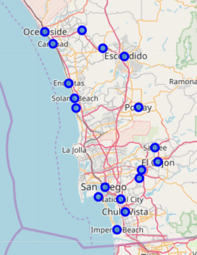

# New Grocery Store in San Diego

## 1. Introduction
For everyone who wants to start their own business, the most concerned question is where to open their business. In this scenario, I am trying to find a location for a new grocery store in San Diego County, CA. The best location should be in the city that has the most potential customers (population of city/number of grocery stores in the city), also as a potential supplier, it should close to the most restaurants in this city (cluster all the restaurants in the neighborhood, the best location should be close to the centroid of the cluster that has the most restaurants). Hope it could bring some insights to future business owners when choosing their dream locations.

## 2. Data
I found two useful datasets: 1) Population of California cities; 2) Geographic coordinates of California cities. From which I can easily extract information of each city in San Diego County, such as geographic coordinates and population of each city and combine as one dataset. With Foursquare API, I could find out the venue information of each city, especially grocery store amount in each city.

## 3. Methodology
1) Population -> figure out the population of each city in San Diego County.
2) Geographic coordinates + Foursquare -> find out the number of grocery stores in each city.
3) Best city location - > has the most potential customers -> ‘New Store Share’ (number of potential customers): population of the city / (number of grocery stores +1 new store) -> sort values -> the city with the largest value would be the best city as the new grocery store location.
4) Best location in the city -> close to the most restaurants in the city -> cluster all the restaurants in the city with Foursquare, the best location should be in the center of the largest cluster, i.e. the centroid.

## 4. Results and Discussion
a) There are **18 cities** in San Diego County and mapped with **folium** (see below). 

 

b) With **Foursquare API** and the **geographic coordinates** of each city, I fetched the venue information for each city, and extracted all the grocery stores in the whole county (see below).

  

c) The number of grocery stores for the cities are listed (see below), for other cities not listed in, the number is 0.

   

d) Potential customer amount: the ‘New Store Share’ value was calculated by dividing the population of each city by (the number of grocery stores of each city + 1). The data was sorted by ‘New Store Share’ in descending order. **The city of San Diego has the largest potential customers, thus it would be the best city for opening a new grocery store.**

  

e) Since I decided to open the grocery store in San Diego city, the next question is where exactly the location would be. Ideally, the grocery store should be close to most of the restaurants, as a potential grocery supplier, thus, I gathered all the restaurant venue information of Foursquare from above, extracted all the restaurant locations (total is 34) in San Diego city, and clustered them into 4 groups using **DBSCAN**, and mapped them in different colors (see below).

  

 

f) From the map above, I could easily tell that the purple dot (cluster 1) is the largest cluster. The best location should be the center of this cluster, i.e. the centroid. Using **NearestCentroid from sklearn**, I got the centroid for cluster1 is: 32.71456327 -117.15607955.

## 5. Conclusion
The best location for the new grocery store is: **32.71456327 -117.15607955**, in the city of San Diego.

## Data Source: 
California cities dataset by Cam Nugent

https://www.kaggle.com/camnugent/california-housing-feature-engineering

## References:
‘Clustering to Reduce Spatial Data Set Size’ by Geoff Boeing

https://geoffboeing.com/2014/08/clustering-to-reduce-spatial-data-set-size/
